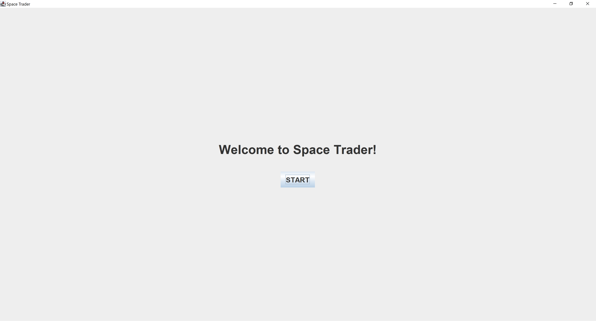
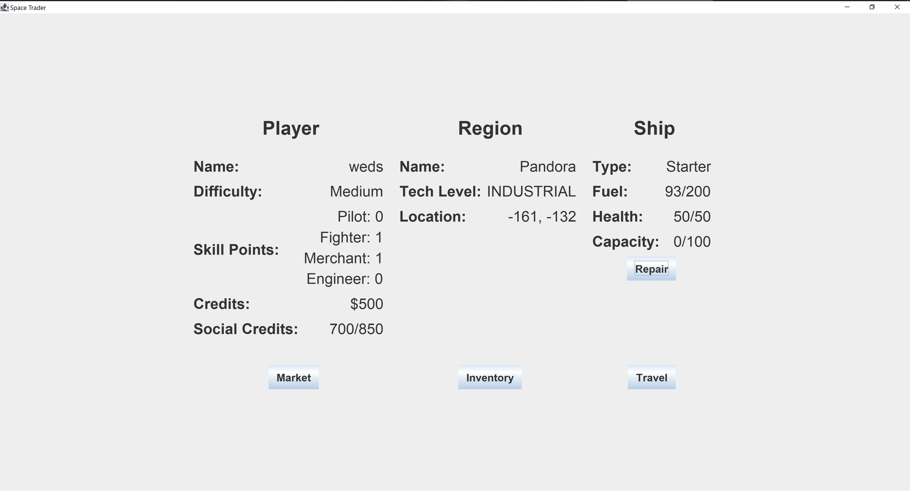

# Space Trader Game
A Java Swing application emulating the classic 
[Space Trader](https://www.spronck.net/spacetrader/STFrames.html) game.

CS 2340 - Fall 2019 - Team 78

**Authors:** [Brock Smith](https://github.com/brockwsmith225), 
[Chris Kim](https://github.com/ChrisGoKim), 
and [Faris Durrani](https://github.com/farisdurrani).  
**Implemented:** Aug - Dec 2019  
**Original repo:** https://github.com/brockwsmith225/2340Project  
**Current repo:** https://github.com/farisdurrani/SpaceTraderGame

## OOD Principles
This game is built with the OOD principles SOLID and GRASP in mind in line 
with best practices in software development for readability, maintainability, 
and flexibility. A more thorough explanation with examples included can be 
found in `Milestone 7 OOD Principles.pdf`.

## How to Run

1. Install Java 14+
2. Navigate to `out\production\SpaceTraderGame`
3. Run the command `java spacetrader.ui.SpaceTrader`(alternatively, run on 
   IntelliJ or Visual Studio Code)

## Screenshots
1. Upon running the program, the below welcome screen emerges:
2. After setting up the game, this is the main screen of the game where 
   players may choose to buy/sell at the Market, look at the Inventory of 
   current items, and Travel to other planets 

## The Goal
The main goal of this game is to accrue enough money to buy the Universe 
item costing $1000 at a certain planet, while not losing all money from 
excessive spending, dying from battles, or losing all fuel.